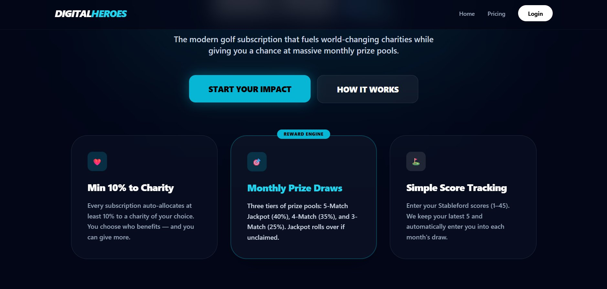
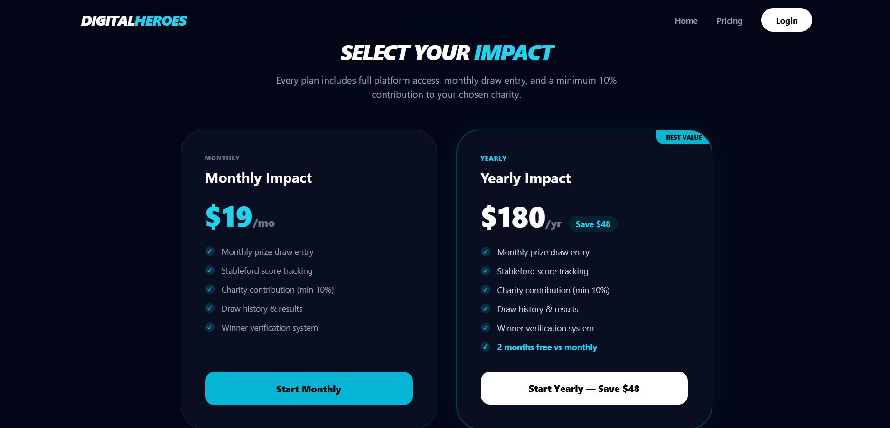
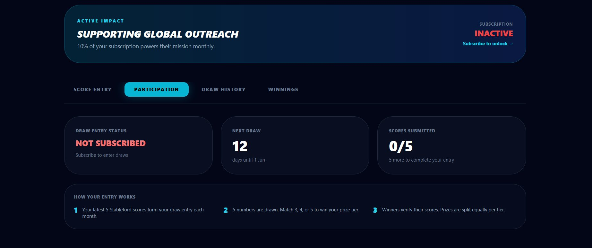
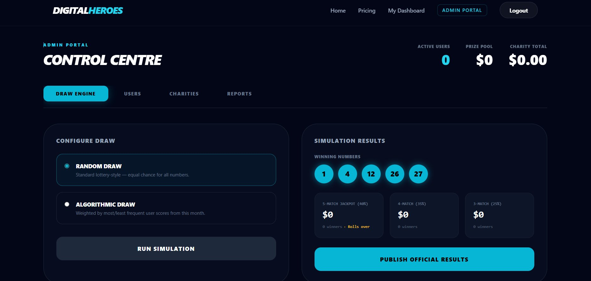

<div align="center">

# ⛳ Digital Heroes — Golf Charity Platform

### Full-Stack SaaS · Subscription Payments · Real-Time Prize Engine · Charitable Giving

[](https://golf-six-tau.vercel.app)
[](https://golf-u6ol.onrender.com)
[](#-tech-stack)

> A production-deployed SaaS platform combining Stripe-powered subscriptions, a real-time algorithmic prize-draw engine, and charitable giving — built end-to-end as a solo full-stack project.

</div>

---

## 🔑 Key Engineering Highlights

- **Stripe Checkout + Webhooks** — end-to-end payment flow with idempotent webhook handling; subscription state driven entirely by Stripe events, not client-side calls
- **Algorithmic Draw Engine** — two simulation modes (uniform random vs. frequency-weighted); jackpot rollover logic with three-tier prize pool splitting across concurrent winners
- **Row-Level Security via Supabase** — JWT-authenticated requests with scoped database policies; service-role key isolated to backend only
- **Rolling Score Window** — Stableford scores stored as JSONB with automatic eviction of the oldest entry beyond 5 scores; avoids unbounded growth without a separate cron job
- **Role-Based Access Control** — admin vs. subscriber routes enforced at middleware level; admin identity validated server-side, never from the client
- **Proof-of-Win Verification Flow** — file upload → payout claim → admin approve/reject cycle with status transitions persisted in the database

---

## 📸 Screenshots

| Landing Page                  | Pricing & Charity Picker            |
| ----------------------------- | ----------------------------------- |
|  |  |

| User Dashboard                          | Admin Draw Engine                           |
| --------------------------------------- | ------------------------------------------- |
|  |  |

---

## ✨ Feature Overview

### Subscriber Experience

| Feature                   | Implementation Detail                                                                                    |
| ------------------------- | -------------------------------------------------------------------------------------------------------- |
| 📅 **Subscription Plans** | Monthly ($19/mo) or Yearly ($180/yr) via Stripe Checkout; webhook activates account                      |
| ⛳ **Score Tracking**     | Stableford scores (1–45) stored in JSONB; rolling 5-score window auto-evicts oldest                      |
| 🎰 **Monthly Prize Draw** | Three-tier pool — 5-match jackpot (40%) · 4-match (35%) · 3-match (25%); jackpot rolls over if unclaimed |
| ❤️ **Charity Allocation** | Subscribers direct 10–100% of their subscription fee to a chosen charity at signup                       |
| 🏆 **Payout Claims**      | Upload proof-of-score to trigger admin review; status tracked through Pending → Paid / Rejected          |

### Admin Panel (`/admin`)

| Feature                   | Implementation Detail                                                                             |
| ------------------------- | ------------------------------------------------------------------------------------------------- |
| 🎲 **Draw Engine**        | Run Random or Algorithmic (frequency-weighted) simulations; publish official results to all users |
| 👥 **User Management**    | View all subscribers, scores, and statuses; approve/reject payout claims; delete accounts         |
| 🏥 **Charity Management** | Full CRUD for charities; toggle featured status shown on the public homepage                      |
| 📋 **Live Reports**       | Real-time stats — active subscribers, current prize pool, total charity raised, full draw history |

---

## 🛠 Tech Stack

| Layer          | Technology                            | Why                                                                     |
| -------------- | ------------------------------------- | ----------------------------------------------------------------------- |
| **Frontend**   | React 18, Tailwind CSS, Framer Motion | Component-driven UI with smooth UX; zero-config styling                 |
| **Backend**    | Node.js, Express.js                   | Lightweight REST API with clean controller/middleware separation        |
| **Database**   | Supabase (PostgreSQL)                 | Relational integrity with JSONB flexibility; built-in auth + RLS        |
| **Auth**       | Supabase Auth (JWT)                   | Stateless auth; tokens verified on every API request                    |
| **Payments**   | Stripe Checkout + Webhooks            | PCI-compliant checkout; subscription lifecycle driven by webhook events |
| **Deployment** | Vercel (frontend) · Render (backend)  | CI/CD on push; environment-isolated secrets                             |

---

## 🗂 Project Structure

```
golf/
├── frontend/
│   └── src/
│       ├── pages/
│       │   ├── Home.jsx          # Landing page with featured charity
│       │   ├── Login.jsx         # Auth — login & signup
│       │   ├── Dashboard.jsx     # User dashboard — scores, draw status, winnings
│       │   ├── AdminPanel.jsx    # Admin — draws, users, charities, reports
│       │   └── Charities.jsx     # Public charities listing
│       ├── components/
│       │   ├── Navbar.jsx        # Auth-aware navigation
│       │   ├── Pricing.jsx       # Plan selection + charity picker
│       │   └── Signup.jsx        # Multi-step signup flow
│       ├── App.jsx               # Route definitions with protected guards
│       └── supabaseClient.js     # Supabase client initialisation
│
└── backend/
    ├── controllers/
    │   ├── userController.js     # Profile CRUD, score management, user admin
    │   ├── drawController.js     # Simulate + publish monthly draws
    │   ├── charityController.js  # Charity CRUD
    │   ├── paymentController.js  # Stripe Checkout session creation
    │   ├── scoreController.js    # Score submission + rolling window logic
    │   └── webhookController.js  # Stripe webhook → subscription activation
    ├── middleware/
    │   └── authMiddleware.js     # JWT verification on protected routes
    └── server.js
```

---

## 🚀 Local Setup

### Prerequisites

- **Node.js** 18+
- A **Supabase** project (free tier works)
- A **Stripe** account (test mode is fine)

### 1 · Clone

```bash
git clone https://github.com/Sunidhi-source/golf.git
cd golf
```

### 2 · Backend

```bash
cd backend && npm install
```

Create **`backend/.env`**:

```env
PORT=5000
SUPABASE_URL=your_supabase_project_url
SUPABASE_KEY=your_supabase_anon_key
SUPABASE_SERVICE_ROLE_KEY=your_supabase_service_role_key
STRIPE_SECRET_KEY=sk_test_...
STRIPE_PUBLISHABLE_KEY=pk_test_...
STRIPE_MONTHLY_PRICE_ID=price_...
STRIPE_YEARLY_PRICE_ID=price_...
STRIPE_WEBHOOK_SECRET=whsec_...
CLIENT_URL=http://localhost:3000
```

```bash
npm start
```

### 3 · Frontend

```bash
cd frontend && npm install
```

Create **`frontend/.env`**:

```env
REACT_APP_SUPABASE_URL=your_supabase_project_url
REACT_APP_SUPABASE_ANON_KEY=your_supabase_anon_key
REACT_APP_API_URL=http://localhost:5000
REACT_APP_ADMIN_EMAIL=admin@123.com
```

```bash
npm start        # → http://localhost:3000
```

### 4 · Database

Run `supabase/SCHEMA_FIX.sql` in the **Supabase SQL Editor** to create all tables and the auto-profile trigger.

---

## 🔐 Test Credentials

| Role          | Email                         | Password  |
| ------------- | ----------------------------- | --------- |
| Administrator | `admin@123.com`               | `hero123` |
| Test User     | _(sign up via the live site)_ | —         |

---

## 🗄 Database Schema

<details>
<summary><strong>profiles</strong></summary>

| Column                | Type        | Notes                                                    |
| --------------------- | ----------- | -------------------------------------------------------- |
| `id`                  | uuid (PK)   | Matches `auth.users.id`                                  |
| `email`               | text        | Auto-populated from auth trigger                         |
| `subscription_status` | text        | `active` / `inactive`                                    |
| `golf_scores`         | jsonb       | Array of `{value, date}`; max 5 entries (rolling window) |
| `charity_id`          | uuid (FK)   | References `charities.id`                                |
| `charity_percent`     | int         | Default 10; user-selected at signup                      |
| `payout_status`       | text        | `Pending` / `Paid` / `Rejected`                          |
| `total_winnings`      | numeric     | Cumulative prize amount                                  |
| `created_at`          | timestamptz | Auto-set                                                 |

</details>

<details>
<summary><strong>charities</strong></summary>

| Column        | Type        | Notes                        |
| ------------- | ----------- | ---------------------------- |
| `id`          | uuid (PK)   | —                            |
| `name`        | text        | Required                     |
| `description` | text        | —                            |
| `is_featured` | boolean     | Controls homepage visibility |
| `created_at`  | timestamptz | —                            |

</details>

<details>
<summary><strong>draws</strong></summary>

| Column             | Type        | Notes                      |
| ------------------ | ----------- | -------------------------- |
| `id`               | uuid (PK)   | —                          |
| `winning_numbers`  | int[]       | 5 numbers drawn            |
| `tier5_winners`    | jsonb       | 5-match jackpot winners    |
| `tier4_winners`    | jsonb       | 4-match winners            |
| `tier3_winners`    | jsonb       | 3-match winners            |
| `jackpot_rollover` | boolean     | `true` if no tier-5 winner |
| `published_at`     | timestamptz | —                          |

</details>

---

## 🎰 Prize Pool Logic

| Tier       | Match  | Pool Share | Rollover                        |
| ---------- | ------ | ---------- | ------------------------------- |
| 🥇 Jackpot | 5 of 5 | 40%        | ✅ Carries forward if unclaimed |
| 🥈 Major   | 4 of 5 | 35%        | ❌                              |
| 🥉 Minor   | 3 of 5 | 25%        | ❌                              |

Multiple winners in the same tier split that tier's prize equally.

---

## ☁️ Deployment Notes

### Frontend — Vercel

Add all `frontend/.env` variables in your Vercel project dashboard. Deploys automatically on `main` push.

### Backend — Render

Add all `backend/.env` variables in Render service settings. Set `CLIENT_URL` to your live Vercel URL for correct Stripe post-checkout redirects.

### Stripe Webhook

Register this endpoint in **Stripe Dashboard → Webhooks**, listening for `checkout.session.completed`:

```
https://your-render-url.onrender.com/api/payments/webhook
```

---

## 👩‍💻 Author

**Sunidhi Sharma** — [github.com/Sunidhi-source](https://github.com/Sunidhi-source)

_Built as a solo end-to-end project: product design, database modelling, REST API, React frontend, Stripe integration, and cloud deployment._
